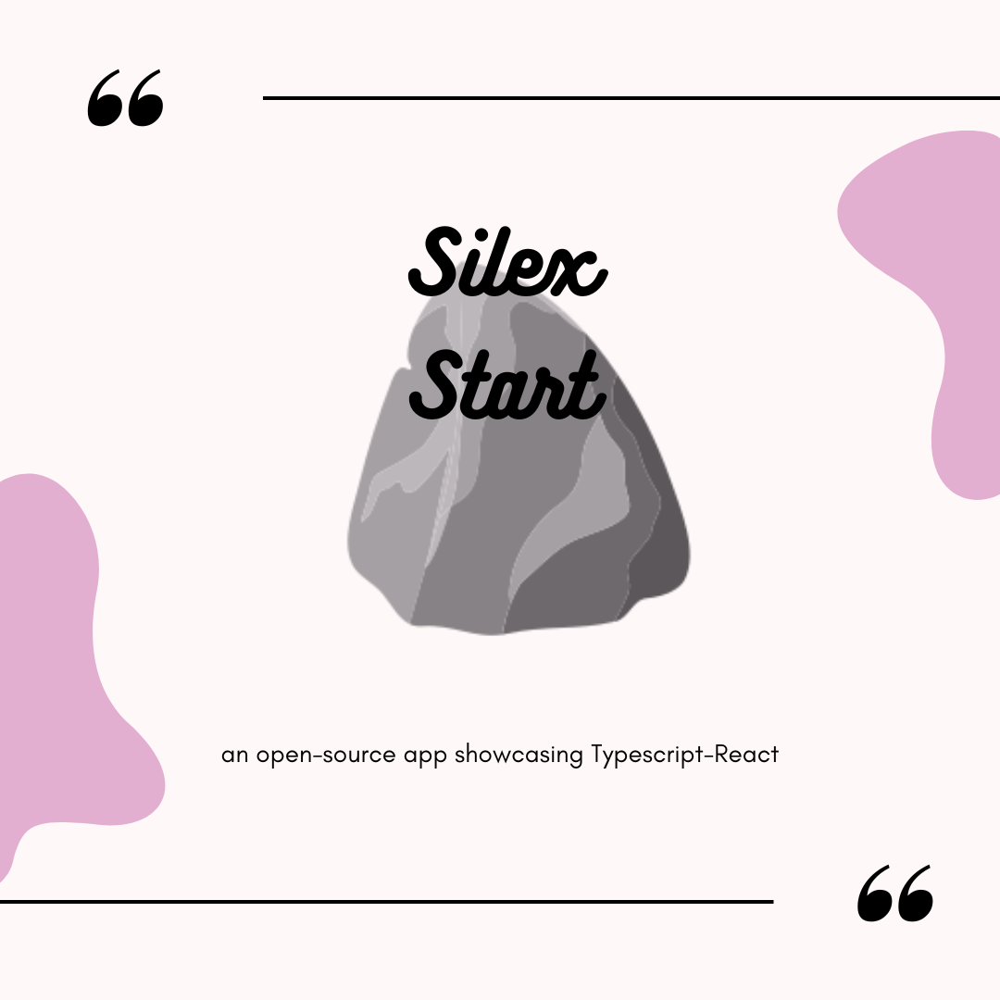

<p align="center">
  
</p>

A vite app with several boards showcasing multiple libraries with React, written in typescript. The app intent is to get familiarized with React.

## Current boards:

- Drag a Star : collection of star with dragging effects. Adapted from https://konvajs.org/docs/react/index.html
- Wheel of Fortune : a wheel that turns and stop, then showing the prize. Adapted from https://konvajs.org/docs/sandbox/Wheel_of_Fortune.html
- Post-it : a board with post-it that you can resize and rotate. Adapted from https://konvajs.org/docs/react/Transformer.html
- Connect circles : a collection of circles connected with arrows. Adapted from https://konvajs.org/docs/sandbox/Connected_Objects.html
- Snake : a snake game where you want to eat fruits
- ... and many other boards

## Contribute

Please feel free to raise a new issue if you see some feasible improvements or you detect a bug. New demos showcasing react-konva abilities are welcome.

### How to add a new demo

Copy this repository on your local path with git clone. Then

```
npm i
npm run dev
```

Copy a existing demo in the `src/demos` folder such as 'drag-a-star'. Rename the exported component with your demo name. Then you can add the demo to the dictionnary of existing demo in the `src/contant.tsx` file

```
export const demosDetails = [

    ... exisisting demos
    ...
    {
      path: "/demos/your-demo-name",
      element: <YourDemo />,
      title: 'Your Demo Title',
      icon: <YourDemoIcon />,
      screenshotUrl: yourDemoScreenshotUrl
    },
```
- path is the route of your demo
- `element` is the actual react component of your demo
- icon can be chosen in [react-icons](https://react-icons.github.io/react-icons/) package
- screenshotUrl is the path to a screenshot of your demo that should be saved in `src/assets` folder.

Once the `demosDetails` array is actualized, navbar and menu should display link to your demo page.


