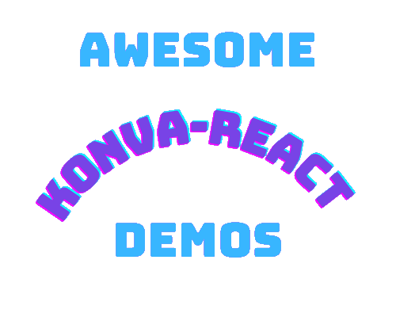

  

A vite app with multiple Canvas Board showcasing Konva with React, written in typescript. The app intent is to get familiarized with Konva-react.

### Current boards:

- Drag a Star : collection of star with dragging effects. Adapted from https://konvajs.org/docs/react/index.html
- Wheel of Fortune : a wheel that turns and stop, then showing the prize. Adapted from https://konvajs.org/docs/sandbox/Wheel_of_Fortune.html
- Post-it : a board with post-it that you can resize and rotate. Adapted from https://konvajs.org/docs/react/Transformer.html
- Connect circles : a collection of circles connected with arrows. Adapted from https://konvajs.org/docs/sandbox/Connected_Objects.html

